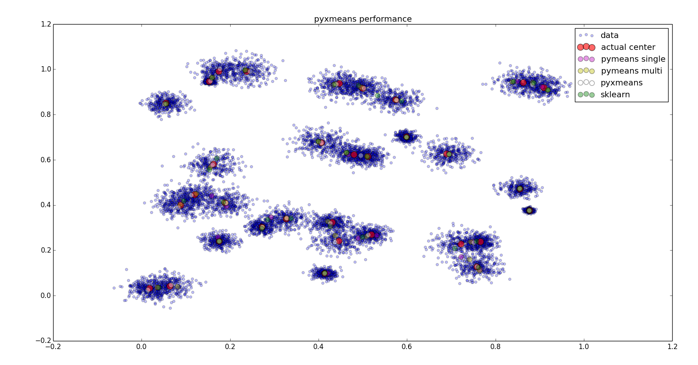

## pyxmeans

This is a quick implementation of
[XMeans](http://www.cs.cmu.edu/~dpelleg/download/xmeans.pdf) for using kmeans
type clustering with an unknown number of clusters.  In order to make this code
runnable, I chose to use MiniBatchKMeans instead of KMeans, but they should be
swappable. 

**Currently** it only supports basic MiniBatch kmeans and does not yet do
XMeans.  However, the MiniBatch implementation is exceedingly fast and uses a
small memory footprint.  On my 2011 MacBook Air, the following benchmarks were
obtained (by running `python -m pyxmeans.benchmark`):

```
$ python -m pyxmeans.benchmark
Creating data
Number of points:  10000
Number of dimensions:  2
Number of clusters:  64
initial BIC:  -58614.411506
initial variance:  0.000913536355991
initial RMS Error:  4.78565971024

Clustering with single-threaded pyxmeans
singlethreaded pyxmeans took 0.042223s
BIC:  -58756.6514152
Variance:  0.000579472415021
RMS Error:  4.79181110795

Clustering with multi-threaded pyxmeans
singlethreaded pyxmeans took 0.121658s
BIC:  -58824.7853377
Variance:  0.000493889809274
RMS Error:  4.78514192219

Clustering with sklearn
singlethreaded pyxmeans took 38.058540s
BIC:  -58909.976141
Variance:  0.000487120549504
RMS Error:  4.78552428169
```



NOTES: 
    * `max_no_improvement` is set to `None` for MiniBatchKMeans to properly
      compare per-iteration speeds since we currently do not support
      early-stopping.
    * RMS Error for the multi-threaded pymeans is higher because that function
      aims at minimizing the variance of the resulting model.


### Dependencies

* [numpy](http://numpy.org/)

### Todo:

* Optimize data layout when dealing with / comparing computed clusters
* Early stopping mechanism
